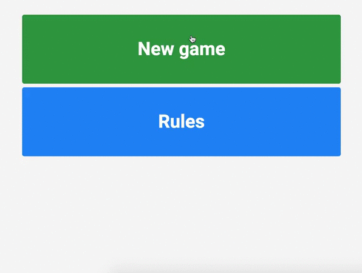

# Taboo game in Vue.JS 2.5 + Vuex + Vue Router + Firebase

[Taboo game](https://en.wikipedia.org/wiki/Taboo_(game)) app written in Vue.JS. I used Vuex as a state manager, Vue router and Firebase where I stored all questions (cards).

## Demo




## Installation

- Clone repository

``` bash
git clone https://github.com/flytomek/vuejs-taboo-game.git
```

- Create new Firebase project
- Add new database (Realtime Database)
- Under RULES change permissions to:

```javascript
{
  "rules": {
    ".read": true,
    ".write": true
  }
}
```
- Under "Project overview" click "Add Firebase to your web app"
- Copy config object, put it into `src/firebase-config.js` file and export. `src/firebase-config.js` file should look like:

```javascript
export const firebaseConfig = {
  apiKey: "API_KEY_HERE",
  authDomain: "domain.firebaseapp.com",
  databaseURL: "https://domain.firebaseio.com",
  projectId: "PROJECT_ID",
  storageBucket: "domain.appspot.com",
  messagingSenderId: "ID"
}
```

- Import sample data from `cards.json` file. You can use [Firebase import](https://github.com/firebase/firebase-import)

- Install dependencies and serve

``` bash
npm install

# serve with hot reload at localhost:8080
npm run dev

# build for production with minification
npm run build
```